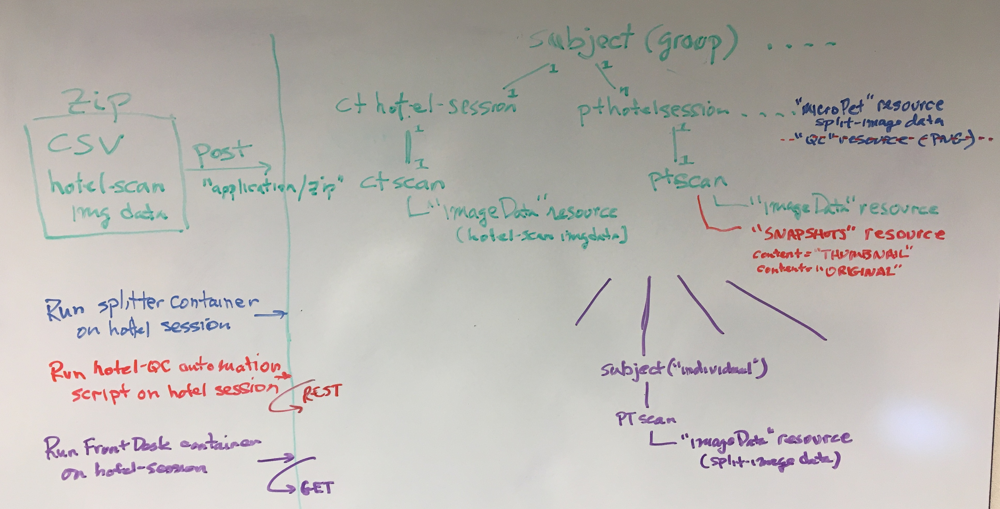

# CCDB XNAT-plugin #

This is the CCDB XNAT-plugin source code repository.

# Description #

This code contains or generates multiple components that work together to implement the CCDB workflow of uploading 
"hotel imaging sessions" and breaking them into individual subjects and session data. 

## Data Types ##

This plugin adds the following data types:
1. hotelPET
1. hotelCT

## Code ##

The following image summarizes the workflow as of 2020-02-03. Items on left depict steps in the workflow while the right side illustrates each steps impact on the XNAT data model.



1. Upload zip to REST endpoint
1. Run hotel-splitter container on session. This can be done manually through the interface or via a REST endpoint.
1. Run hotel-QC script on hotel session. This can be done in the UI via an automation script, or via a REST call. 
Ideally, this would
be done as part of the hotel-splitter container command. However, Container Service currently has several limitations that
made breaking this out separately. The resource catalog entries for the snaphot images must have content = 'THUMBNAIL' and 'ORIGINAL'. Container Service does not support setting attributes on resource files. This is currently implemented as an automation script that uses the XNAT REST Api to create the SNAPSHOT resources. Ideally, this script, with it's native access to XNAT code would not use REST.
1. Run the FrontDesk container on hotel sessions. This can be done in the UI or by calling the REST endpoint directly.

# To Do #

There currently is not a mechanism to run the entire workflow from a single interaction. XNAT currently lacks workflow management that could allow the coordination of multiple steps like those above.  Code needs to be written to do this.

# Build #

```
./gradlew clean fatJar
```

# Configure #

1. Hotel-Splitter Container
    1. The code to build this container is in hotelImageSplitterContainer folder of this repo. Follow the instruction there to 
    build the container. Containers can be uploaded/downloaded to Docker hubs or moved manually between machines. The hotel-splitter container has a script with the steps to manually move the container from the build environment to the production environment.
1. Hotel-QC Automation Script
    1. This script is at scripts/attachQCresources.groovy.
    1. Follow the steps to enable this script on sessions in appropriate projects at XXX.
1. FrontDesk Container
    1. Building FrontDesk Container
    1. The automation script to run this step from the UI is at scripts/frontdesk_curl.groovy
